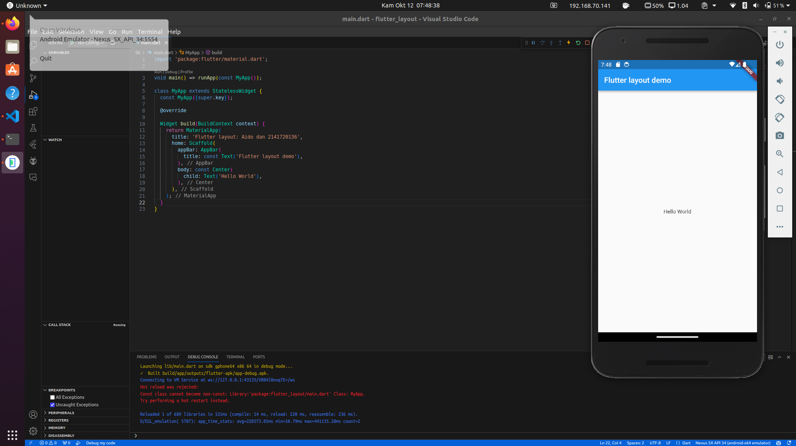

# flutter_layout
Aido Luthfi AL Hakim / 2141720136
## Praktikum 1
### Langkah 1: Membangun Layout di Flutter
### Langkah 2: Buka file lib/main.dart


### Langkah 3: Identifikasi layout diagram

### Langkah 4: Implementasi title row
```
Widget titleSection = Container(
    padding: const EdgeInsets.all(32),
    child: Row(
      children: [
        Expanded(
          /* soal 1*/
          child: Column(
            crossAxisAlignment: CrossAxisAlignment.start,
            children: [
              /* soal 2*/
              Container(
                padding: const EdgeInsets.only(bottom: 8),
                child: const Text(
                  'Wisata Pantai Pulodoro di Malang Selatan',
                  style: TextStyle(
                    fontWeight: FontWeight.bold,
                  ),
                ),
              ),
              Text(
                'Kabupaten Malang, Jawa Timur, Indonesia',
                style: TextStyle(
                  color: Colors.grey[500],
                ),
              ),
            ],
          ),
        ),
        /* soal 3*/
        Icon(
          Icons.star,
          color: Colors.red[500],
        ),
        const Text('41'),
      ],
    ),
  );
```

## Praktikum 2: Implementasi button row
### Langkah 1: Buat method Column _buildButtonColumn
```
Column _buildButtonColumn(Color color, IconData icon, String label) {
    return Column(
      mainAxisSize: MainAxisSize.min,
      mainAxisAlignment: MainAxisAlignment.center,
      children: [
        Icon(icon, color: color),
        Container(
          margin: const EdgeInsets.only(top: 8),
          child: Text(
            label,
            style: TextStyle(
              fontSize: 12,
              fontWeight: FontWeight.w400,
              color: color,
            ),
          ),
        ),
      ],
    );
```
### Langkah 2: Buat widget buttonSection
```
Widget build(BuildContext context) {
    Color color = Theme.of(context).primaryColor;
    Widget buttonSection = Row(
      mainAxisAlignment: MainAxisAlignment.spaceEvenly,
      children: [
        _buildButtonColumn(color, Icons.call, 'CALL'),
        _buildButtonColumn(color, Icons.near_me, 'ROUTE'),
        _buildButtonColumn(color, Icons.share, 'SHARE'),
      ],
    );
```
### Langkah 3: Tambah button section ke body

## Praktikum 3: Implementasi text section
### Langkah 1: Buat widget textSection
```
    Widget textSection = Container(
      padding: const EdgeInsets.all(32),
      child: const Text(
        // 'Carilah teks di internet yang sesuai '
        // 'dengan foto atau tempat wisata yang ingin '
        // 'Anda tampilkan. '
        // 'Tambahkan nama dan NIM Anda sebagai '
        // 'identitas hasil pekerjaan Anda. '
        // 'Selamat mengerjakan 🙂.',
        'Pantai Pulodoro adalah salah satu pantai yang terletak di Kabupaten Malang, Jawa Timur, Indonesia. Pantai Pulodoro memiliki pasir putih yang lembut dan ombak yang cukup besar. Pantai ini juga memiliki pemandangan yang indah, dengan hamparan pasir putih yang luas dan bebatuan karang yang menjorok ke laut. Pantai ini juga memiliki beberapa pulau kecil yang berada di dekatnya, yaitu Pulau Nusa Barong, Pulau Nusa Kambangan, dan Pulau Nusa Kucing. - Aido Luthfi Al Hakim (2141720136)',
        softWrap: true,
      ),
    );
```
### Langkah 2: Tambahkan variabel text section ke body

## Praktikum 4: Implementasi image section
### Langkah 1: Siapkan aset gambar
```
  assets:
    - images/pantai.jpg
```
### Langkah 2: Tambahkan gambar ke body
```
Image.asset(
              'images/pantai.jpg',
              width: 600,
              height: 240,
              fit: BoxFit.cover,
            ),
```
### Langkah 3: Terakhir, ubah menjadi ListView
```
body: ListView(
          children: [
```

