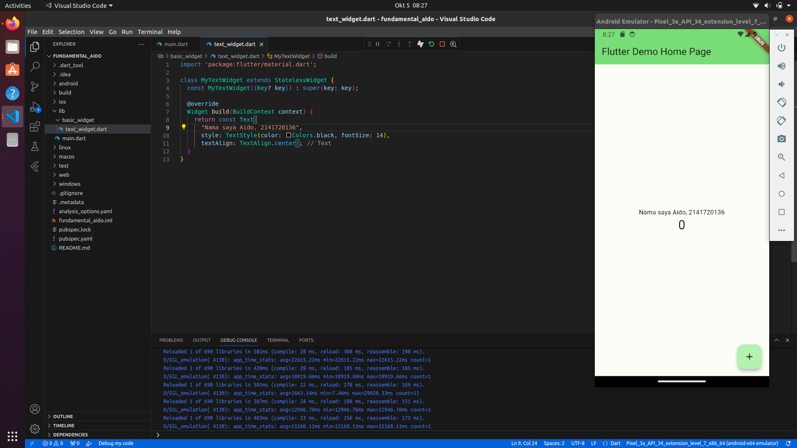
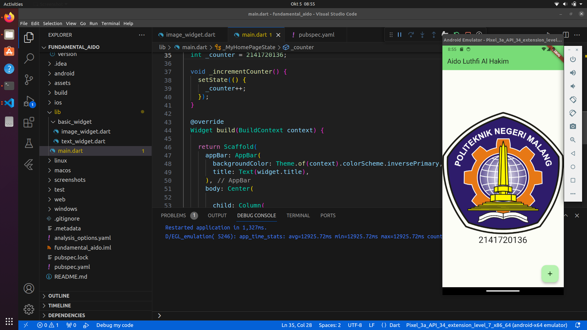
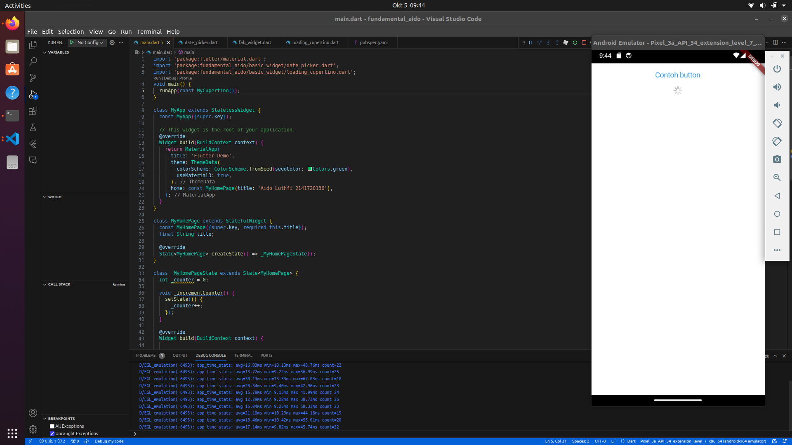
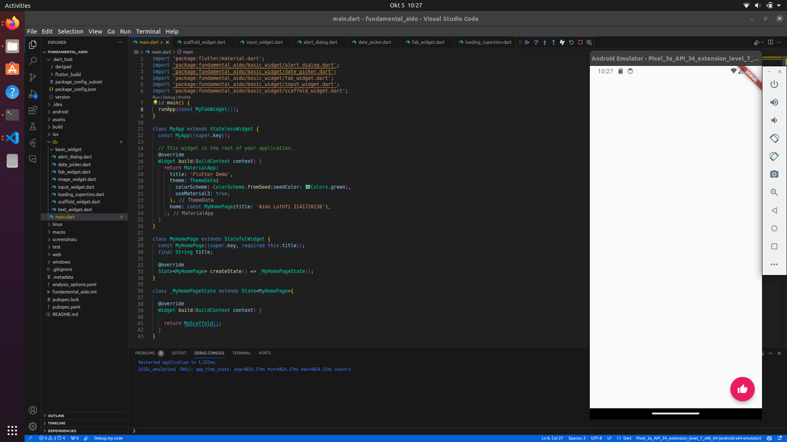
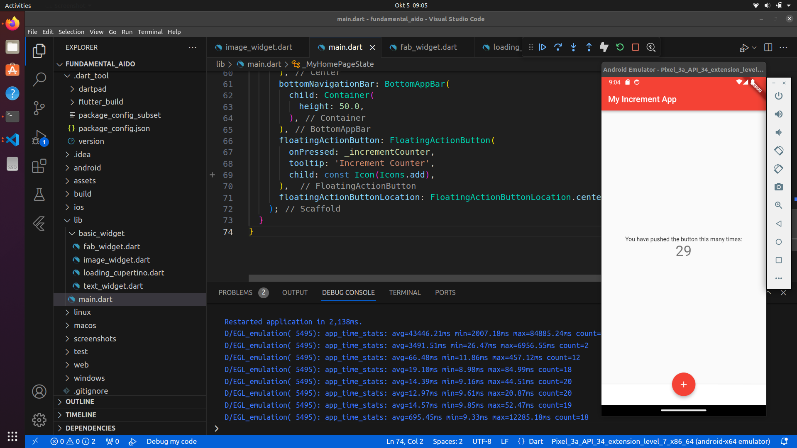
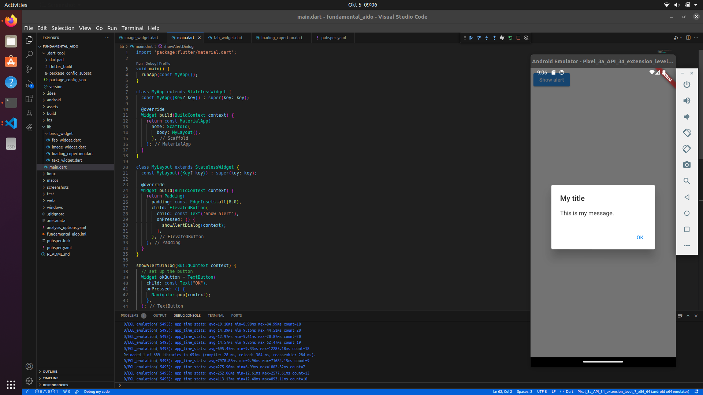
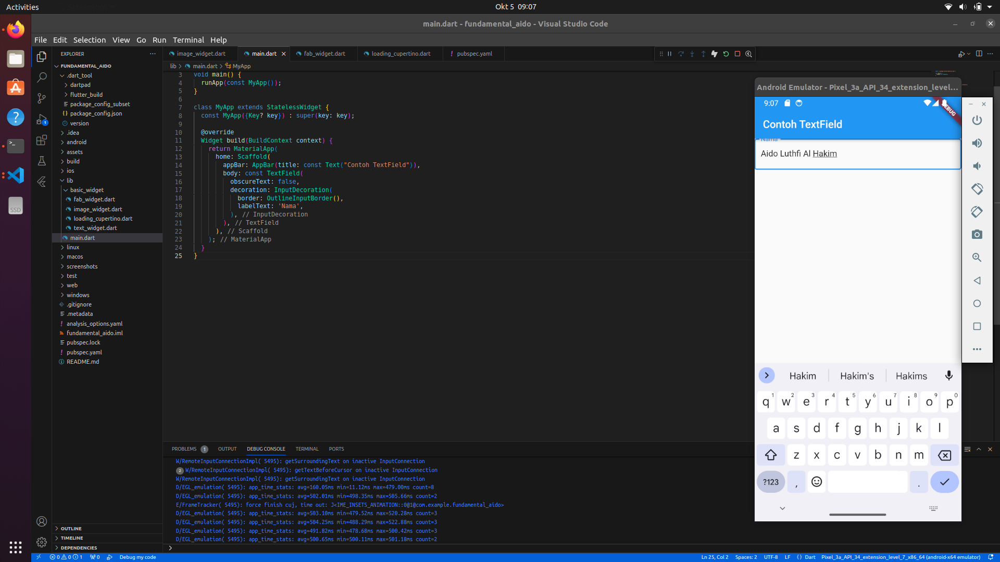
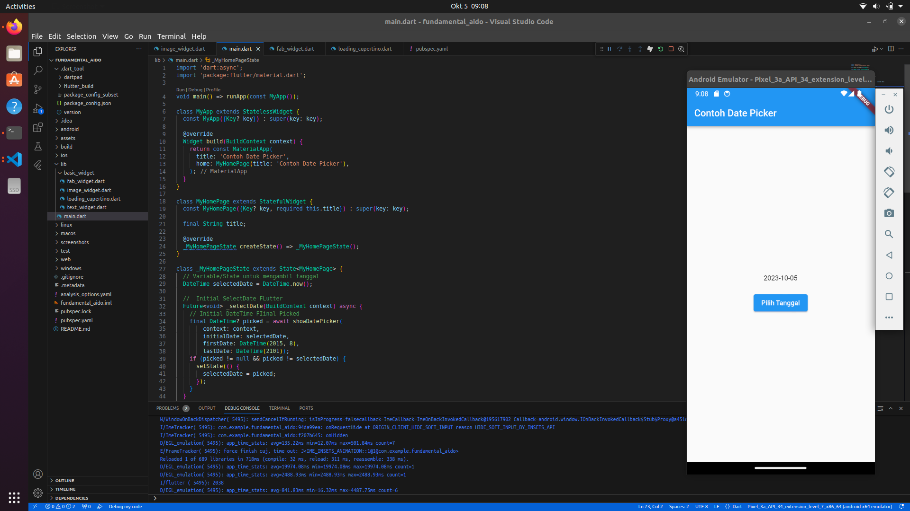
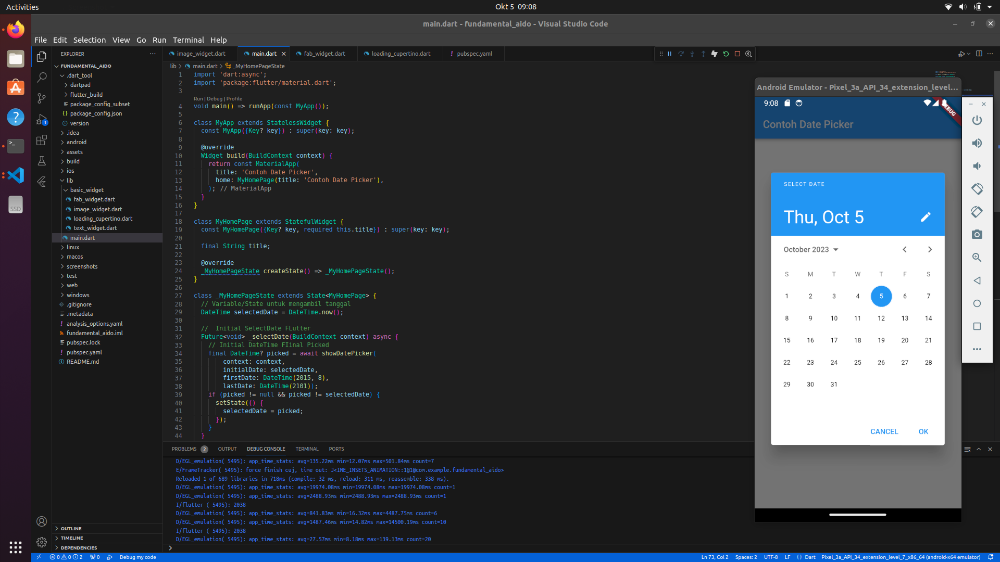
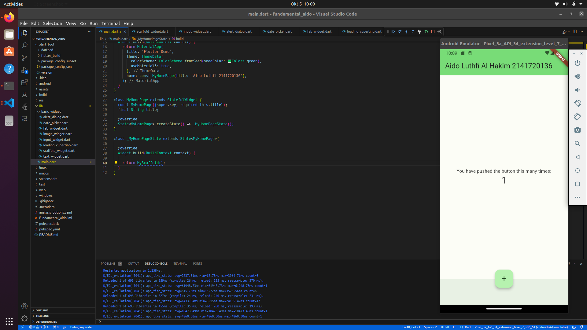

# Flutter Fundamental 
Nama : Aido Luthfi Al Hakim,
Absen : 6,
Kelas : 3A TI,
NIM : 2141720136,

## Praktikum 3
### Langkah 1: Text Widget


### Langkah 2: Image Widget


## Praktikum 4
### Langkah 1: Cupertino Button dan Loading Bar
dengam mengganti MyApp pada main menjadi class MyCupertino maka cupertino laoding bisa kita tampilkan
```
void main() {
  runApp(const MyCupertino());
}
```

### Langkah 2: Floating Action Button (FAB)

### Langkah 3: Scaffold Widget

### Langkah 4: Dialog Widget

### Langkah 5: Input dan Selection Widget

### Langkah 6: Date and Time Pickers



## Tugas Praktikum
Pada praktikum 4 mulai dari Langkah 3 sampai 6, buatlah file widget tersendiri di folder basic_widgets, kemudian pada file main.dart cukup melakukan import widget sesuai masing-masing langkah tersebut!
### Scaffold Widget
```
import 'package:flutter/material.dart';

class MyScaffold extends StatefulWidget {
  const MyScaffold({Key? key}) : super(key: key);

  @override
  State<MyScaffold> createState() => _MyScaffoldState();
}

class _MyScaffoldState extends State<MyScaffold> {
  int _counter = 0;

  void _incrementCounter() {
    setState(() {
      _counter++;
    });
  }

  Widget build(BuildContext context) {
    return Scaffold(
      appBar: AppBar(
        backgroundColor: Theme.of(context).colorScheme.inversePrimary,
        title: const Text('Aido Luthfi Al Hakim 2141720136'),
      ),
      body: Center(
        child: Column(
          mainAxisAlignment: MainAxisAlignment.center,
          children: <Widget>[
            const Text('You have pushed the button this many times:'),
            Text(
              '$_counter',
              style: Theme.of(context).textTheme.headline4,
            )
          ],
        ),
      ),
      bottomNavigationBar: BottomAppBar(
        child: Container(
          height: 50.0,
        ),
      ),
      floatingActionButton: FloatingActionButton(
        onPressed: _incrementCounter,
        tooltip: 'Increment Counter',
        child: const Icon(Icons.add),
      ),
      floatingActionButtonLocation: FloatingActionButtonLocation.centerDocked,
    );
  }
}
```

