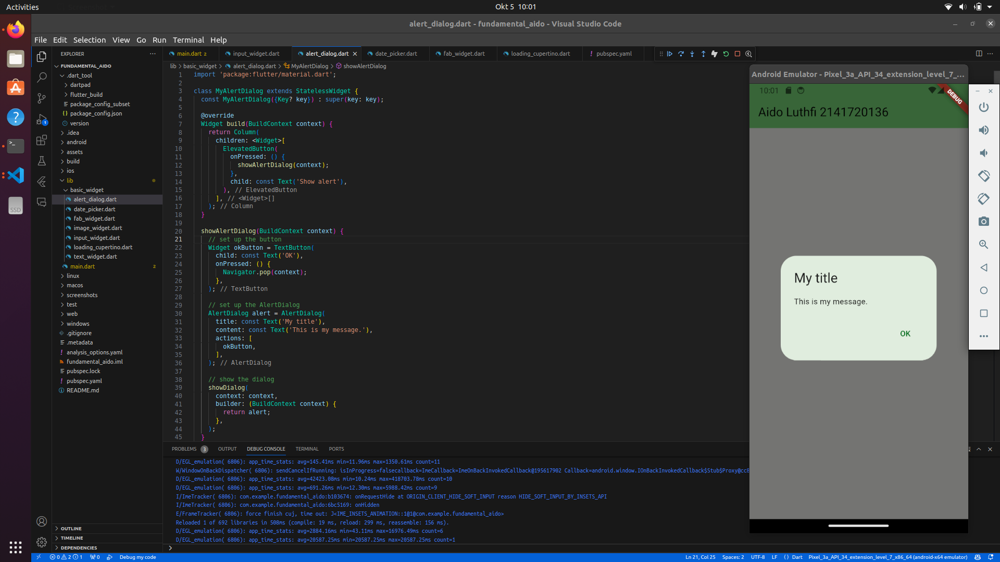
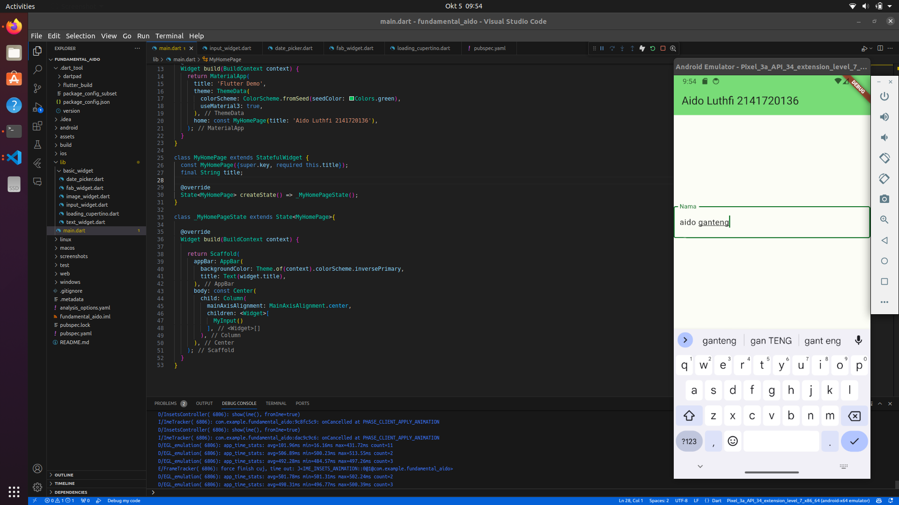
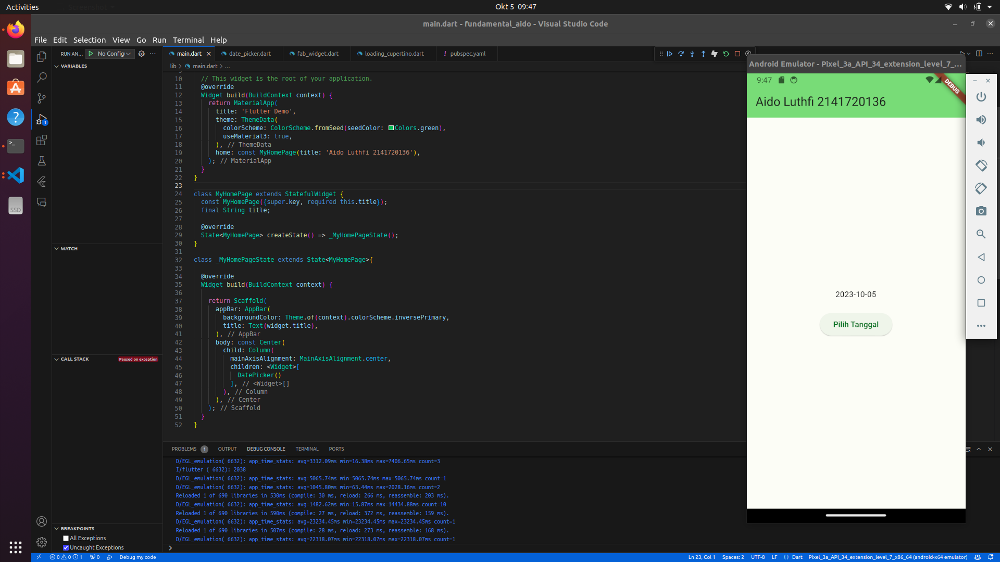
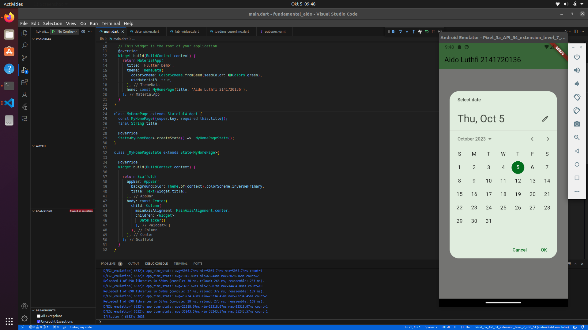

# Flutter Fundamental 
Nama : Aido Luthfi Al Hakim,
Absen : 6,
Kelas : 3A TI,
NIM : 2141720136,

## Praktikum 3
### Langkah 1: Text Widget


### Langkah 2: Image Widget


## Praktikum 4
### Langkah 1: Cupertino Button dan Loading Bar
dengam mengganti MyApp pada main menjadi class MyCupertino maka cupertino laoding bisa kita tampilkan
```
void main() {
  runApp(const MyCupertino());
}
```

### Langkah 2: Floating Action Button (FAB)

### Langkah 3: Scaffold Widget

### Langkah 4: Dialog Widget

### Langkah 5: Input dan Selection Widget

### Langkah 6: Date and Time Pickers


## Tugas Praktikum
Pada praktikum 4 mulai dari Langkah 3 sampai 6, buatlah file widget tersendiri di folder basic_widgets, kemudian pada file main.dart cukup melakukan import widget sesuai masing-masing langkah tersebut!
### Scaffold Widget
pada scaffold_widget.dart:
```
import 'package:flutter/material.dart';

class MyScaffold extends StatefulWidget {
  const MyScaffold({Key? key}) : super(key: key);

  @override
  State<MyScaffold> createState() => _MyScaffoldState();
}

class _MyScaffoldState extends State<MyScaffold> {
  int _counter = 0;

  void _incrementCounter() {
    setState(() {
      _counter++;
    });
  }

  Widget build(BuildContext context) {
    return Scaffold(
      appBar: AppBar(
        backgroundColor: Theme.of(context).colorScheme.inversePrimary,
        title: const Text('Aido Luthfi Al Hakim 2141720136'),
      ),
      body: Center(
        child: Column(
          mainAxisAlignment: MainAxisAlignment.center,
          children: <Widget>[
            const Text('You have pushed the button this many times:'),
            Text(
              '$_counter',
              style: Theme.of(context).textTheme.headline4,
            )
          ],
        ),
      ),
      bottomNavigationBar: BottomAppBar(
        child: Container(
          height: 50.0,
        ),
      ),
      floatingActionButton: FloatingActionButton(
        onPressed: _incrementCounter,
        tooltip: 'Increment Counter',
        child: const Icon(Icons.add),
      ),
      floatingActionButtonLocation: FloatingActionButtonLocation.centerDocked,
    );
  }
}
```
pada main.dart diganti:
```
class _MyHomePageState extends State<MyHomePage>{

  @override
  Widget build(BuildContext context) {

    return MyScaffold();
  }
}
```


### Dialog Widget
pada alert_dialog.dart
```
import 'package:flutter/material.dart';

class MyAlertDialog extends StatelessWidget {
  const MyAlertDialog({Key? key}) : super(key: key);

  @override
  Widget build(BuildContext context) {
    return Column(
      children: <Widget>[
        ElevatedButton(
          onPressed: () {
            showAlertDialog(context);
          },
          child: const Text('Show alert'),
        ),
      ],
    );
  }

  showAlertDialog(BuildContext context) {
    // set up the button
    Widget okButton = TextButton(
      child: const Text('OK'),
      onPressed: () {
        Navigator.pop(context);
      },
    );

    // set up the AlertDialog
    AlertDialog alert = AlertDialog(
      title: const Text('My title'),
      content: const Text('This is my message.'),
      actions: [
        okButton,
      ],
    );

    // show the dialog
    showDialog(
      context: context,
      builder: (BuildContext context) {
        return alert;
      },
    );
  }
}
```



### Input dan Selection Widget
pada input_widget.dart
```
import 'package:flutter/material.dart';

class MyInput extends StatelessWidget {
  const MyInput({Key? key}) : super(key: key);

  @override
  Widget build(BuildContext context) {
    return const Column(
      children: <Widget>[
        TextField(
          obscureText: false,
         decoration: InputDecoration(
            border: OutlineInputBorder(),
           labelText: 'Nama',
           ),
          ),
      ]
    );
  }
}
```


### Date and Time Pickers
pada dart_picker.dart
```
import 'dart:async';
import 'package:flutter/material.dart';

class DatePicker extends StatefulWidget {
  const DatePicker({Key? key}) : super(key: key);

  @override
  State<DatePicker> createState() => _DatePickerState();
}

class _DatePickerState extends State<DatePicker> {
  // Variable/State untuk mengambil tanggal
  DateTime selectedDate = DateTime.now();

  //  Initial SelectDate FLutter
  Future<void> _selectDate(BuildContext context) async {
    // Initial DateTime FIinal Picked
    final DateTime? picked = await showDatePicker(
        context: context,
        initialDate: selectedDate,
        firstDate: DateTime(2015, 8),
        lastDate: DateTime(2101));
    if (picked != null && picked != selectedDate) {
      setState(() {
        selectedDate = picked;
      });
    }
  }

  @override
  Widget build(BuildContext context) {
    return Column(
      children: <Widget>[
        Text("${selectedDate.toLocal()}".split(' ')[0]),
        const SizedBox(
          height: 20.0,
        ),
        ElevatedButton(
          onPressed: () => {
            _selectDate(context),
            // ignore: avoid_print
            print(selectedDate.day + selectedDate.month + selectedDate.year)
          },
          child: const Text('Pilih Tanggal'),
        ),
      ],
    );
  }
}
```


