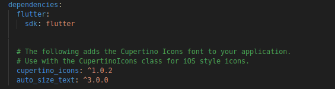
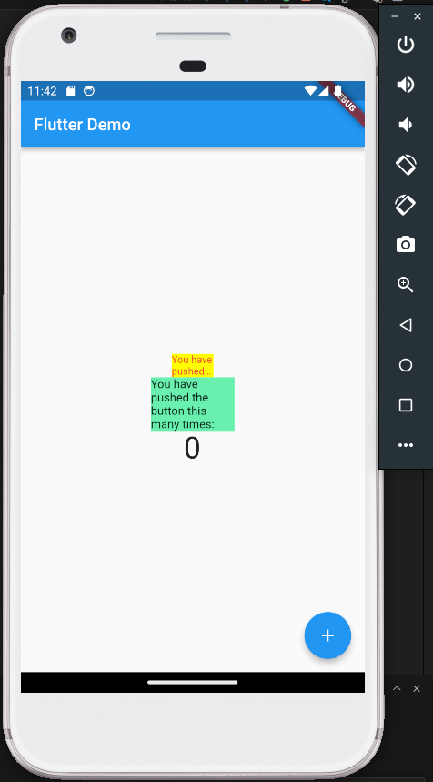

# plugin_autotext

A new Flutter project.

## Getting Started

Aido Luthfi Al Hakim / 2141720136 / 2141720136

### Langkah 2: Menambahkan Plugin
```
flutter pub add auto_size_text
```
Jika berhasil, maka akan tampil nama plugin beserta versinya di file pubspec.yaml pada bagian dependencies.


Perintah flutter pub add auto_size_text digunakan untuk secara otomatis menambahkan paket Flutter bernama "auto_size_text" ke proyek Anda. Ini memperbarui berkas proyek Anda, mengunduh dan menginstal paket tersebut, dan memungkinkan Anda untuk menggunakan fungsionalitas dari paket "auto_size_text" dalam proyek Flutter Anda tanpa harus mengelola dependensi secara manual.


### Langkah 3-5
#### Langkah 3: Buat file red_text_widget.dart
#### Langkah 4: Tambah Widget AutoSizeText
#### Langkah 5: Buat Variabel text dan parameter di constructor

Terjadi error pada Langkah 4 karena perubahan yang Anda lakukan pada red_text_widget.dart memerlukan beberapa perubahan tambahan dalam proyek Anda. Berikut adalah beberapa penyebab umum error:

- Impor Paket yang Tidak Dilakukan: Anda harus mengimpor paket auto_size_text ke dalam berkas red_text_widget.dart agar Anda dapat menggunakan komponen-komponen dari paket tersebut. Jika Anda tidak mengimpor paket ini, maka Flutter tidak akan mengenali simbol AutoSizeText.

- Variabel text yang Tidak Didefinisikan: Variabel text yang Anda gunakan dalam AutoSizeText perlu didefinisikan terlebih dahulu di dalam metode build. Variabel ini harus mengandung teks yang akan ditampilkan oleh AutoSizeText.

- Paket Belum Diunduh: Perintah flutter pub get belum dijalankan setelah menambahkan dependensi paket. Ini menyebabkan Flutter tidak dapat menemukan paket "auto_size_text" karena paket tersebut belum diunduh dan diinstal dalam proyek Anda.


```
import 'package:auto_size_text/auto_size_text.dart';
import 'package:flutter/material.dart';

class RedTextWidget extends StatelessWidget {
  final String text;

  const RedTextWidget({Key? key, required this.text}) : super(key: key);

  @override
  Widget build(BuildContext context) {
    return AutoSizeText(
      text,
      style: const TextStyle(color: Colors.red, fontSize: 14),
      maxLines: 2,
      overflow: TextOverflow.ellipsis,
    );
  }
}
```
### Langkah 6: Tambahkan widget di main.dart
```
import 'package:flutter/material.dart';
import 'red_text_widget.dart';

void main() {
  runApp(MyApp());
}

class MyApp extends StatelessWidget {
  @override
  Widget build(BuildContext context) {
    return MaterialApp(
      home: MyHomePage(),
    );
  }
}

class MyHomePage extends StatefulWidget {
  MyHomePage({Key? key}) : super(key: key);

  @override
  _MyHomePageState createState() => _MyHomePageState();
}

class _MyHomePageState extends State<MyHomePage> {
  int _counter = 0;

  void _incrementCounter() {
    setState(() {
      _counter++;
    });
  }

  @override
  Widget build(BuildContext context) {
    return Scaffold(
      appBar: AppBar(
        title: Text('Flutter Demo'),
      ),
      body: Center(
        child: Column(
          mainAxisAlignment: MainAxisAlignment.center,
          children: <Widget>[
            Container(
              color: Colors.yellowAccent,
              width: 50,
              child: const RedTextWidget(
                text: 'You have pushed the button this many times:',
              ),
            ),
            Container(
              color: Colors.greenAccent,
              width: 100,
              child: const Text(
                'You have pushed the button this many times:',
              ),
            ),
            Text(
              '$_counter',
              style: TextStyle(fontSize: 36),
            ),
          ],
        ),
      ),
      floatingActionButton: FloatingActionButton(
        onPressed: _incrementCounter,
        tooltip: 'Increment',
        child: Icon(Icons.add),
      ),
    );
  }
}
```

Run aplikasi tersebut dengan tekan F5, maka hasilnya akan seperti berikut.


